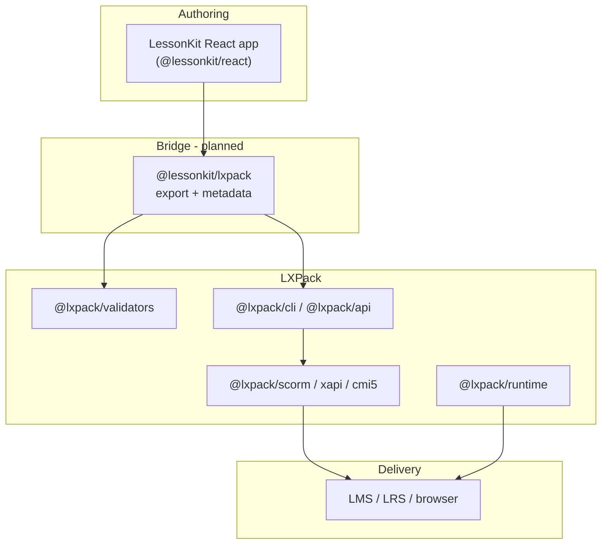

# LXPack upgrades for LessonKit interoperability

> **For LXPack maintainers:** see **[LXPACK_UPGRADE_PLAN_FOR_MAINTAINERS.md](LXPACK_UPGRADE_PLAN_FOR_MAINTAINERS.md)** for the forward-looking upgrade plan (responsibility shifts, proposed APIs, release sequence). This page is the historical checklist and LessonKit-side integration status.

This document captures the improvements we wanted in [LXPack](https://github.com/eddiethedean/lxpack)
so it works better as the **packaging and LMS export layer** for
[LessonKit](https://github.com/eddiethedean/lessonkit), plus what LessonKit should do next.

## Status

- **LXPack v0.4.0** — baseline SPA + `@lxpack/api` + `lessonkit.json` merge (historical checklist below).
- **LXPack v0.6.0** — `packageLessonkit()`, interchange schema in `@lxpack/validators`, `@lxpack/spa-bridge`, `@lxpack/tracking-schema` telemetry map, interchange `runtime` + `assessments`. **LessonKit 0.8.2** integrates these (`^0.6.0`); see [maintainer upgrade plan](LXPACK_UPGRADE_PLAN_FOR_MAINTAINERS.md#status-lxpack-v060--shipped).

LessonKit is React-first authoring (`@lessonkit/react`). LXPack is a manifest-driven compiler and
runtime (`course.yaml`, markdown/HTML/component lessons, SCORM/xAPI/cmi5 export). The two projects
are complementary: LessonKit owns the developer experience; LXPack owns validation, preview, and LMS
artifacts.

Related LessonKit docs:

- [`ROADMAP.md`](https://github.com/eddiethedean/lessonkit/blob/main/ROADMAP.md) — integration strategy (0.6.0+)
- [`SPEC.md`](https://github.com/eddiethedean/lessonkit/blob/main/SPEC.md) — LessonKit technical spec
- [`PLAN.md`](https://github.com/eddiethedean/lessonkit/blob/main/PLAN.md) — product vision

---

## Current integration plan (LessonKit side)

LessonKit’s preferred path is **Strategy A** from the roadmap:

1. Author courses in React with `@lessonkit/react`.
2. Export to an LXPack project via **`@lessonkit/lxpack`** (shipped in 0.6.0 — see [`PACKAGING.md`](PACKAGING.md)).
3. Run `lxpack validate` and `lxpack build --target …` for LMS delivery (via `validateLessonkitProject` / `packageLessonkitCourse` or the golden example scripts).

The adapter maps a `LessonkitCourseDescriptor` plus built SPA assets into LXPack’s `course.yaml` and `lessonkit.json`; multi-lesson UX stays in your React app for `single-spa` layouts.

---

## What changed in LXPack v0.4.0 (impact on LessonKit)

Because LXPack now implements the features we previously asked for, LessonKit should treat LXPack
as the **default packaging toolchain** and focus on building a thin, well-tested adapter.

Recommended LessonKit next steps:

1. ~~Create `@lessonkit/lxpack`~~ — **done** (0.6.0).
2. ~~Decide a stable mapping for identities~~ — **done** (identity v1; see [`IDENTITY.md`](IDENTITY.md)).
3. ~~Add at least one end-to-end example~~ — **done** ([`examples/lxpack-golden/`](../examples/lxpack-golden/)).
4. ~~Add a CI smoke test that runs LXPack packaging for that example~~ — **done** (`.github/workflows/checks.yml` packaging job; [`integration/`](../integration/); [`e2e/`](../e2e/)).

---

## Design goals for interoperability

| Goal | Why it matters |
|------|----------------|
| **Preserve React authoring** | LessonKit users should not rewrite courses as YAML/markdown to ship to an LMS. |
| **Stable identity model** | `courseId`, `lessonId`, assessment ids must map 1:1 into tracking, xAPI, and SCORM suspend data. |
| **Shared tracking semantics** | Completion, quiz pass/fail, and time-on-task should mean the same thing in both runtimes. |
| **Programmatic packaging** | `@lessonkit/lxpack` needs library APIs, not only CLI subprocesses. |
| **npm-first consumption** | LessonKit uses npm workspaces; LXPack packages should install cleanly without requiring pnpm for consumers. |

---

## Gap analysis

### 1. Authoring model mismatch

| LXPack today | LessonKit today |
|--------------|-----------------|
| Declarative `course.yaml` + file-based lessons | JSX component tree (`Course`, `Lesson`, `Quiz`, …) |
| Lesson types: `markdown`, `html`, `component` | Rich React composition, custom layout, app state |
| Built-in widgets (`callout`, `image-card`, …) | Framework primitives + user-defined UI |

**Pain:** Exporting LessonKit → LXPack today implies serializing React to markdown/HTML or
re-implementing interactions as LXPack component lessons. That breaks fidelity and accessibility
work done in React.

### 2. No first-class “hosted React bundle” lesson type

LXPack can package standalone web apps, but there is no documented lesson type for:

- A Vite/React build output as a **lesson SCO** with known entry (`index.html`)
- Wiring that lesson into `flow`, completion rules, and multi-SCO SCORM 2004

**Pain:** LessonKit’s natural artifact is a built SPA, not a folder of markdown files.

### 3. CLI-centric integration surface

LXPack’s primary interface is `@lxpack/cli` (`init`, `preview`, `validate`, `build`). LessonKit
needs:

- `validateCourse(project)` / `buildCourse(project, target)` as **importable functions**
- Typed options and structured errors (for CI and `@lessonkit/lxpack`)

**Pain:** Subprocess + stdout parsing is fragile for monorepo CI and IDE integrations.

### 4. Tracking and xAPI vocabulary alignment

LessonKit (0.1.x) emits telemetry events and minimal xAPI statements (`started`, `completed`).
LXPack has mature tracking, completion thresholds, quiz YAML, and export-time embedding.

**Pain:** Without a shared event/verb map, adapters guess at semantics and LRS reports diverge.

### 5. Assessment model differences

| LXPack | LessonKit |
|--------|-----------|
| Author YAML in `assessments/`; keys embedded at build | Inline `Quiz` / `KnowledgeCheck` in React |
| `passingScore`, `maxAttempts`, shuffle, feedback modes | Simple correct/incorrect + `useQuizState` hooks |

**Pain:** Export must invent assessment YAML from React props or lose quiz metadata.

### 6. Theming and accessibility

LessonKit targets WCAG 2.1 AA with React semantics and `@lessonkit/accessibility` helpers. LXPack
runtime uses markdown sanitization, HTML interactions, and `runtime.theme` CSS classes.

**Pain:** Branding and a11y behavior may differ between preview (LXPack) and author preview
(LessonKit/Vite) unless theme contracts align.

---

## Recommended (now implemented) LXPack capabilities

These were originally prioritized upgrade requests. With LXPack v0.4.0 implementing them, they are
now the capabilities LessonKit should lean on.

### P0 — React / SPA lesson type

**Now:** Use the SPA/React lesson type to package LessonKit’s built output without rewriting lessons
as markdown.

```yaml
lessons:
  - id: phishing-101
    title: Phishing Awareness
    type: spa
    path: dist/lessons/phishing-101   # folder with index.html + assets
    runtime:
      mount: root                      # optional; default #root
```

**Behavior:**

- Package the folder as a launchable unit in standalone, SCORM 1.2, SCORM 2004 (SCO), xAPI, cmi5.
- Expose a **stable parent bridge** (`window.parent.lxpack` or `postMessage`) for:
  - `completeLesson({ lessonId })`
  - `reportAssessment({ id, score, passed })`
  - optional xAPI statement passthrough

**Why:** Lets LessonKit ship `vite build` output per lesson without converting UI to markdown.

**LessonKit integration notes:**

- Prefer a stable bridge surface (for completion, scoring, and optional statement passthrough).
- Keep LessonKit as the “authoring runtime”; let LXPack own LMS packaging and launch surfaces.

---

### P0 — Programmatic build and validate API

**Now:** Prefer importing validate/build APIs from LXPack in `@lessonkit/lxpack` instead of shelling
out to `lxpack` via subprocess.

```ts
import { validateCourse, buildCourse } from "@lxpack/api";

const result = await validateCourse({ courseDir: "/path/to/course", target: "scorm12" });
const artifact = await buildCourse({ courseDir, target: "scorm2004", output: "./out.zip" });
```

**Requirements:**

- Structured result: `{ ok, errors: [{ path, rule, message }], warnings }`
- No global process cwd assumptions; all paths explicit
- Works when imported from npm (LessonKit) without pnpm

**Why:** This keeps LessonKit packaging deterministic, testable, and easy to integrate into CI.

---

### P1 — Import / interchange schema (`lessonkit.json` or `lxpack.import`)

**Now:** Use the interchange format (if provided by LXPack) to avoid duplicating metadata between
LessonKit and `course.yaml`.

```json
{
  "format": "lessonkit",
  "version": "1",
  "course": { "id": "cyber-basics", "title": "Cybersecurity Basics" },
  "lessons": [
    {
      "id": "phishing-101",
      "title": "Phishing Awareness",
      "type": "spa",
      "build": { "command": "npm run build", "outputDir": "dist" }
    }
  ],
  "assessments": [],
  "tracking": { "completion": { "threshold": 0.9 } }
}
```

**Behavior:**

- `lxpack validate` merges interchange + generated `course.yaml` (or generates yaml at build time).
- Validators understand LessonKit ids and required fields.

**Why:** Reduces duplication between LessonKit metadata and hand-maintained `course.yaml`.

---

### P1 — Shared tracking event catalog

**Now:** Align LessonKit telemetry and xAPI verbs with LXPack’s shared event catalog/schema.

| Event | xAPI verb (suggested) | SCORM mapping |
|-------|----------------------|---------------|
| `lesson_started` | `initialized` / custom | `cmi.core.lesson_status` |
| `lesson_completed` | `completed` | completion |
| `quiz_answered` | `answered` | interaction |
| `quiz_completed` | `completed` | score |
| `course_completed` | `completed` | course complete |

Publish as `@lxpack/tracking-schema` (or extend `@lessonkit/core` with LXPack-compatible exports).

**Why:** LessonKit and LXPack runtimes report the same analytics to LRS and internal sinks.

---

### P1 — Assessment interchange from structured data

**Now:** Prefer structured assessment interchange/build-time injection so LessonKit can export quiz
metadata without writing author-only files into the learner artifact.

```ts
buildCourse({
  courseDir,
  target: "scorm12",
  assessments: [{ id: "final_quiz", questions: [...] }], // validated by @lxpack/validators
});
```

**Why:** `@lessonkit/lxpack` can extract `Quiz` props / config from React without writing
`assessments/*.yaml` to disk.

---

### P2 — Plugin slot for custom lesson runtimes

**Now:** Use LXPack’s plugin/runtime extension points (if shipped) to avoid forking LXPack lesson
types just to support LessonKit.

```ts
registerLessonRuntime("lessonkit-react", {
  validate(lesson, ctx) { ... },
  bundle(lesson, ctx) { ... },
  preview(lesson, ctx) { ... },
});
```

**Why:** LessonKit can register a runtime once instead of forking LXPack lesson types.

---

### P2 — Theme token bridge

**Now:** Use LXPack’s theme bridge (if shipped) so LessonKit themes carry through to packaged
artifacts.

```yaml
runtime:
  theme: lessonkit-default
  cssVariables:
  --lk-color-primary: "#2563eb"
```

**Why:** Visual parity between LessonKit dev preview and LXPack-packaged learner view.

---

### P3 — Documentation and examples

If not already present in LXPack docs, add:

- **Guide:** “Package a React (LessonKit) course”
- **Example repo:** `examples/lessonkit-spa/` with Vite build + `lxpack build`
- **Migration table:** LessonKit component → LXPack lesson type

---

## Suggested division of responsibility



| Layer | Owner | Responsibility |
|-------|--------|----------------|
| Authoring UX | LessonKit | Components, hooks, a11y, Vite templates |
| Export adapter | `@lessonkit/lxpack` | Build SPA(s), emit interchange + invoke LXPack |
| Validation & packaging | LXPack | Schema, path containment, SCORM/xAPI/cmi5 ZIPs |
| Learner runtime | LXPack (+ SPA bridge) | Navigation, flow, LMS APIs, quiz engine where applicable |

---

## Phased rollout (cross-repo)

| Phase | LXPack | LessonKit |
|-------|--------|-----------|
| **1** | Document SPA lesson type + bridge API (even if experimental) | Spike `@lessonkit/lxpack` export to static `dist/` |
| **2** | Ship `@lxpack/api` validate/build | Wire `lessonkit package` → `lxpack build` |
| **3** | Tracking schema + assessment build injection | Align `@lessonkit/xapi` verbs with schema |
| **4** | Plugin runtime registration | Optional: embed `@lxpack/runtime` navigation shell around SPA |

---

## Non-goals (for now)

- Merging the two repos into one monorepo
- Replacing LXPack markdown authoring with LessonKit-only workflows
- Requiring LessonKit authors to learn full `course.yaml` before they can ship

---

## Open questions for LXPack maintainers

1. **Single-SCO vs multi-SCO:** Should a LessonKit `Course` map to one SCORM package or one SCO per `Lesson`?
2. **Answer keys in SPA lessons:** Should quiz scoring stay in LXPack runtime only, or allow client-side scoring inside the SPA with signed/embedded config?
3. **Versioning:** How should `lxpackBridge.v1` evolve without breaking published LessonKit courses?
4. **npm vs pnpm:** Can release CI guarantee `@lxpack/*` packages work as npm dependencies in LessonKit’s workspace?

---

## Summary

LXPack already solves problems LessonKit should not rebuild (SCORM manifests, ZIP packaging,
xAPI/cmi5, validation, preview). With LXPack v0.4.0 implementing the suggested features, the
highest-value work for LessonKit is now:

1. **Build `@lessonkit/lxpack`** as the packaging adapter  
2. **Ship one end-to-end SCORM export example**  
3. **Lock down identity + tracking mappings** (course/lesson/assessment ids)  

That delivers LMS-ready packages without forcing authors out of React.
